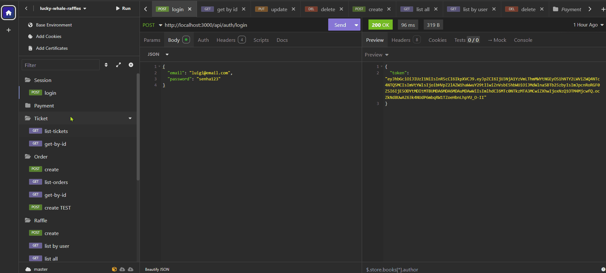

# 🐳 Lucky Whale Raffles - Backend

API RESTful construída com Node.js e Express, utilizando o Prisma ORM para interagir com um banco de dados PostgreSQL. Responsável por gerenciar campanhas, usuários e sorteios.

---

<br>

## 📥 Instalação

Siga os passos abaixo para executar o projeto localmente:

  ### 1. Acesse a pasta do backend
  ```bash
  cd lucky-whale-raffles/lucky-whale_backend
  ```
  
  ### 2. Instale as dependências
   ```bash
  npm install
  ```

  ### 3. Configure as variáveis de ambiente copiando o arquivo .env-example para .env e ajustando conforme necessário.

  ### 4. Execute as migrações do banco de dados:
  ```bash
  npx prisma migrate dev
  ```
  
  ### Inicie o servidor
   ```bash
  npm start
  ```
<br>

## 📚 Dependências
- express
- prisma
- dotenv
- cors
- jsonwebtoken

<br>

## 🌐 Repositório
🔗 <a href="https://github.com/SrBaliardo/lucky-whale-raffles">Repositório completo </a>

<br>

## 🖼️ Fluxo por imagem:<br>
<div>
  
</div>

<br>

🤝 Autor
Desenvolvido por <a href="https://github.com/SrBaliardo">SrBaliardo</a>
